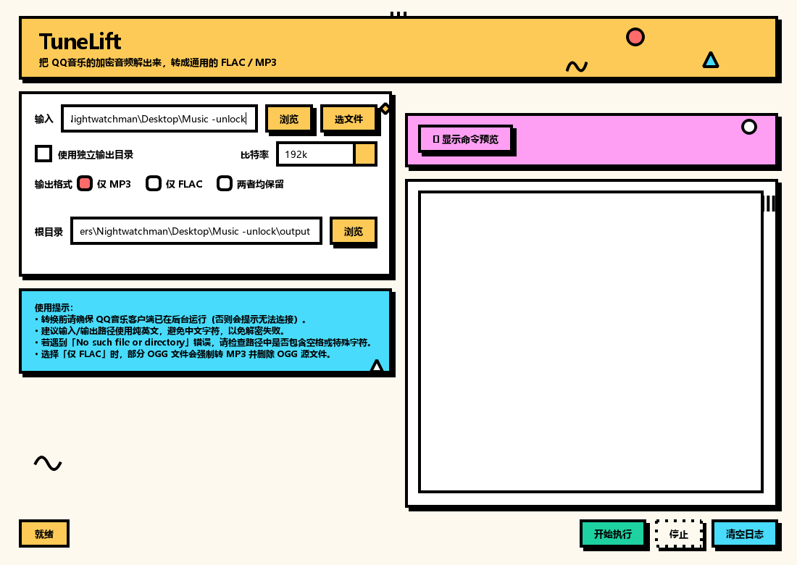

# TuneLift

把 QQ音乐下载的加密音频（`.mflac` / `.mgg`）一键转换成通用的 FLAC / MP3。

TuneLift 通过注入 QQ音乐客户端完成解密，再调用 ffmpeg 转码。提供图形界面和命令行两种用法，
自己构建出来的包内置 ffmpeg 与解密脚本，解压即用。



## 功能特点

- **图形界面** —— 可视化设置输入目录、输出模式、比特率、输出格式，带命令预览和实时日志
- **三种输出格式** —— 仅 MP3 / 仅 FLAC / 两者均保留
- **两种输出模式** —— 根目录模式（自动创建 `mp3`、`flac` 子文件夹），或独立目录模式（分别指定）
- **批量处理** —— 递归扫描输入目录及其子目录，一次处理全部 `.mflac` / `.mgg`
- **实时进度** —— 解密和转码进度实时刷新；单个文件出错只跳过它，不影响其余文件
- **可续跑** —— 已经解出来的文件自动跳过，换输出格式重跑不会重复劳动
- **开箱即用** —— 单个发行包，无需安装

## 系统要求

- Windows 10 / 11（64 位）
- **必须提前启动 QQ音乐电脑客户端并保持运行** —— 解密依赖它的进程
- 磁盘空间：默认只出 MP3，占用较小；选择「两者均保留」时需要预留 FLAC（约等于原文件大小）加 MP3（约其 1/5 ~ 1/3）的空间

> 解密依赖 `QQMusic.exe`。没启动客户端会提示「请确保QQ音乐客户端正在运行后重试」并退出。

## 使用范围与风险提示

本工具只做**格式转换**：把 QQ音乐客户端**已经能为你播放**的加密音频转成通用格式。
它不提供账号、不绕过登录，也拿不到你没有权限播放的内容。

需要自行承担的风险：

- **账号** —— 绕过技术措施违反 QQ音乐的用户协议，平台有权直接封号，
  **VIP 身份不构成豁免**。
- **版权** —— 依据《著作权法》第五十三条，避开技术措施属于侵权行为。自己离线收听
  与真正被追究之间的距离，主要看你有没有把文件传出去。
- 本工具通过注入客户端进程工作，客户端更新后可能失效或检测到这类操作。
  **恕不承诺适配更新，也不提供使用支持。**

**免责声明**：本项目仅供学习与技术研究使用。请只处理自己合法购买、自己有权访问的文件，
不传播、不分享、不用于商业用途，并遵守所在地区的法律法规。因使用本工具产生的一切后果
由使用者自行承担。如版权所有者或相关平台认为本项目不当，请提 issue 联系，我们会及时处理。

## 处理流程

1. **读取文件** —— 递归扫描输入目录里的 `.mflac` / `.mgg`
2. **解密** —— 注入 QQ音乐进程，把加密音频解密成 FLAC / OGG
3. **转码** —— 调用 ffmpeg 转成 MP3
4. **输出** —— 按所选格式写出文件

## 使用方式

### 图形界面

启动 `TuneLift.exe`，界面分三块：上方参数设置、中间命令预览、下方运行日志。

操作步骤：

1. 点「浏览」选一个文件夹（会递归处理里面的加密音频），或点「选文件」直接挑一首歌；留空则用程序所在目录
2. 选择输出模式（建议根目录模式）；需要分别指定位置就勾选「使用独立输出目录」
3. 设置 MP3 比特率（默认 192k；选「跟随源文件」就用源文件自身的码率。无论选哪个都不会高于源文件）
4. 选择输出格式（仅 MP3 / 仅 FLAC / 两者均保留）
5. 点「开始执行」，等待完成

转换过程中日志窗口实时刷新，命令预览会同步显示即将执行的命令行，方便核对参数。

### 命令行

命令行版是 `main.exe`（图形界面也用它做后端）：

```bat
main.exe -i "D:\下载" -o "D:\我的音乐" -b 320k --keep-flac
```

`-i` 给目录就递归处理里面所有加密音频；**只想转一首歌时，直接给它文件路径即可**，不必先建目录：

```bat
main.exe -i "D:\下载\某首歌.mflac" -o "D:\我的音乐"
```

目录里没有加密音频时，程序什么都不做——不会创建输出目录，也不碰任何文件。

| 参数 | 说明 |
|---|---|
| `-i` / `--input` | 输入目录（递归处理其中的 `.mflac` / `.mgg`），或单个加密音频文件；默认为当前目录 |
| `-o` / `--output` | 输出根目录（默认当前目录下的 `output`），其下自动创建 `mp3` 子文件夹；配合 `--keep-flac` 还会创建 `flac` |
| `--flac-dir` | 独立指定 FLAC 输出目录（仅在 `--keep-flac` 时有效） |
| `--mp3-dir` | 独立指定 MP3 输出目录（覆盖默认） |
| `-b` / `--bitrate` | MP3 比特率，如 `128k` / `192k` / `320k`，或 `source` 表示跟随源文件（默认 `192k`）。**无论选哪个，输出都不会高于源文件自身的码率** |
| `--keep-flac` | 保留解密后的 FLAC（默认不保留） |
| `--no-mp3` | 不生成 MP3，仅保留 FLAC（忽略 `--keep-flac`） |

退出码：`0` 全部成功；`2` 环境或参数不满足（输入路径不存在、给的不是加密音频、缺 `ffmpeg.exe`、输出目录不可用、QQ音乐未运行、解密脚本未生效）；`3` 有文件解密失败；`4` 有文件转码失败。方便在批处理里判断成败。

### 输出结构

```
输出目录/
├── mp3/     仅 MP3、两者均保留
└── flac/    仅 FLAC、两者均保留
```

文件名保持不变，只改扩展名。

## 常见问题

**提示「请确保QQ音乐客户端正在运行后重试」**

先启动 QQ音乐客户端并保持运行。如果已经启动仍报错，试试以管理员身份运行。

**提示「hook 脚本没有生效」**

QQ音乐开着，但还没加载 `QQMusicCommon.dll`。在 QQ音乐里随便播放一首歌再重新运行本程序即可。

**解密失败，提示 `invalid size` 或类似错误**

可能是 QQ音乐更新了加密算法，内置的 `hook_qq_music.js` 不再兼容。

**转换后的 MP3 音质不佳**

默认 192k。界面上可以改，命令行用 `-b 320k`。比特率越高文件越大。

注意输出不会高于源文件自身的码率：如果源文件（比如某些 `.mgg` 解出来的 OGG）只有 96k，
就算选 320k 也会按 96k 输出——从有损源往上转，音质不会变好，文件只会变大。

**能处理子文件夹吗？**

可以，会递归遍历输入目录下的所有子目录。

**程序运行时弹出命令行窗口，能隐藏吗？**

图形界面版本来就不显示命令行窗口；命令行版会显示，便于查看进度。

**杀毒软件报毒**

程序使用了 frida 动态注入技术（用于与 QQ音乐进程通信），部分杀毒软件会误报。把 `TuneLift.exe` 加入信任区即可，或临时关闭杀毒软件后再运行。

## 开发

需要 uv 和 Python 3.12。

```bash
uv sync
```

直接跑源码（先确保 QQ音乐在运行）：

```bash
uv run py GUI.py
```

```bash
uv run py main.py -i "D:\下载" -o "D:\输出"
```

> 图形界面在打包好的发行版里会把同目录的 `main.exe` 当后端拉起来。**从源码跑时它不存在，
> 会自动退回用当前解释器执行同目录的 `main.py`**，所以不必先打包也能用界面。
> 想跑打包后的版本再执行 `build.bat`。

跑测试和 lint：

```bash
uv run pytest
```

```bash
uv run ruff check .
```

测试全部离线，不需要 QQ音乐或 ffmpeg。

### 自己构建

本项目不发布编译好的成品，需要的话自行构建：

```bat
build.bat
```

需要 **uv**（推荐）或 Python 3.12：

- uv：<https://docs.astral.sh/uv/getting-started/installation/>
- Python：<https://www.python.org/downloads/>

产物在 `dist\TuneLift\`。

### 发布

推 `v*` 标签会在 Actions 上跑一遍完整验证，然后建一个**只有发布说明**的 Release，
不附带任何编译产物：

```bash
git tag v1.0.0
```

```bash
git push origin v1.0.0
```

## 许可

本项目以 **Apache License 2.0** 发布，全文见 [LICENSE](LICENSE)。

发行包里还包含若干第三方组件（Qt/PySide6、FFmpeg、Frida、Python 等），它们各自适用
自己的许可条款，不适用本项目的 Apache-2.0。完整清单、各义务的履行情况与源码获取方式见
[THIRD-PARTY-NOTICES.md](THIRD-PARTY-NOTICES.md)，各许可的完整文本在 [LICENSES/](LICENSES/) 下。

## 致谢

本项目建立在以下组件之上：

- **Frida** —— 动态代码注入框架，解密靠它把钩子脚本注入 QQ音乐进程
- **FFmpeg** —— 负责把解密出来的音频转成 MP3
- **Qt / PySide6** —— 图形界面
- **Python** —— 运行时

它们各自适用自己的开源许可，署名与义务说明见 [THIRD-PARTY-NOTICES.md](THIRD-PARTY-NOTICES.md)。

程序图标由豆包生成。
